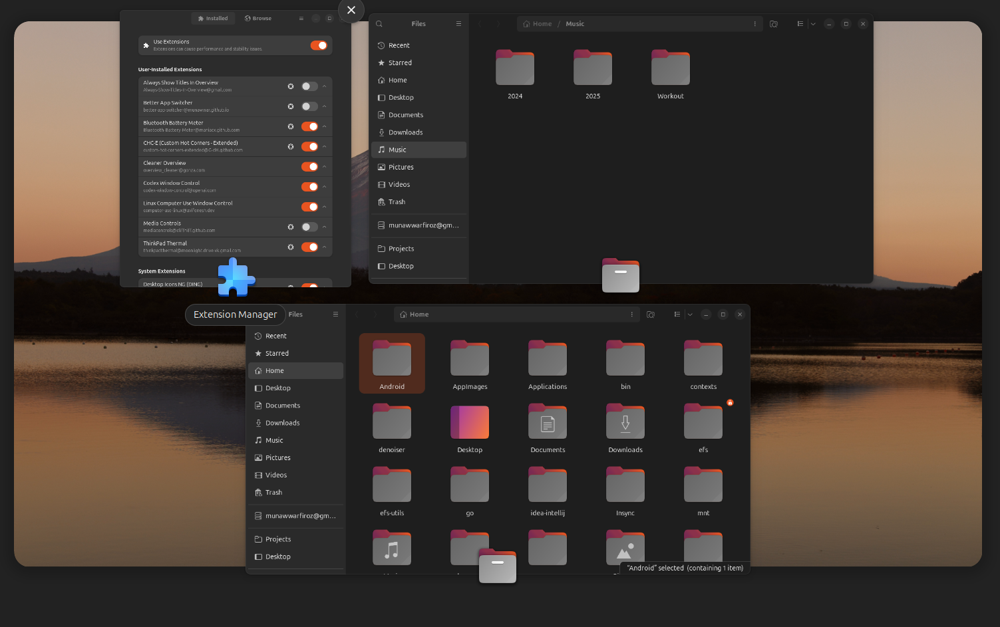
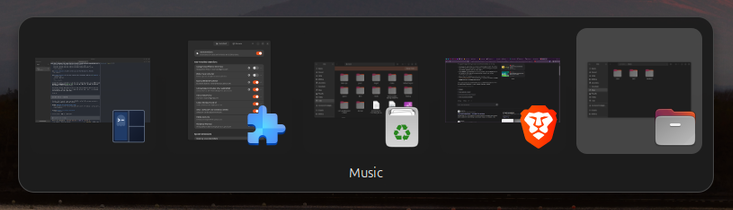
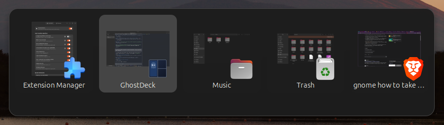

# Better App Switcher

Have you ever wished GNOME had shortcut to switch between windows of same app? This (GNOME Shell 46) extension adds:

- **Super+W** to open Activities overview filtered to the focused application.
- **Alt+&#96;** opens a window switcher filtered to the focused application. Keep Alt held and tap &#96; again to move through its windows; release Alt to activate the selected window. **Super+&#96;** remains GNOME's built-in same-app switcher.
- **Alt+Tab** shows a title under every window in the regular window switcher.
- The Activities overview always shows each window title below its thumbnail.

Both extension shortcuts can be changed in **Extensions → Better App Switcher → Preferences**. Type shortcuts like `Super + W` or `Alt + KEY_GRAVE` and apply them. Alt+&#96; uses GNOME's existing `switch-group` binding by default. After assigning another shortcut, GNOME's original Alt+&#96; behavior remains available.

**Recommended companion:** [Cleaner Overview](https://extensions.gnome.org/extension/3759/cleaner-overview/) makes overview window previews the same height and orders them by most recent use. It pairs well with Better App Switcher's overview titles and app-specific window switching.

## Screenshots

Titles in Activities overview and Window switcher

| Before | After |
| --- | --- |
|  |  |

| Before | After |
| --- | --- |
|  |  |

The overview title feature is inspired by [Always Show Titles In Overview](https://github.com/nlpsuge/Always-Show-Titles-In-Overview) and adapts [GNOME Shell 46's window preview behavior](https://github.com/GNOME/gnome-shell/blob/46.0/js/ui/windowPreview.js).

Licensed under GPL-2.0-or-later; see [LICENSE](LICENSE). The extension UUID uses the `munawwar.github.io` namespace.

## Install

For a local install, compile the schema and install an archive that includes the license:

```sh
glib-compile-schemas schemas
zip -r /tmp/better-app-switcher.zip metadata.json extension.js prefs.js schemas LICENSE
gnome-extensions install --force /tmp/better-app-switcher.zip
```

For an upload to extensions.gnome.org, create the package with GNOME's packer and include the license:

```sh
gnome-extensions pack --force --extra-source=LICENSE --out-dir=/tmp .
```

On Wayland, log out and back in after installing so GNOME Shell discovers the update. The extension can be enabled, disabled, or removed from the **Extensions** app.
